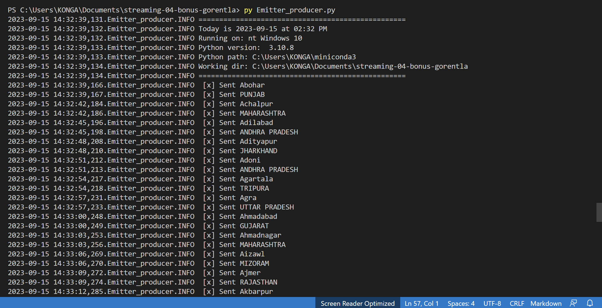
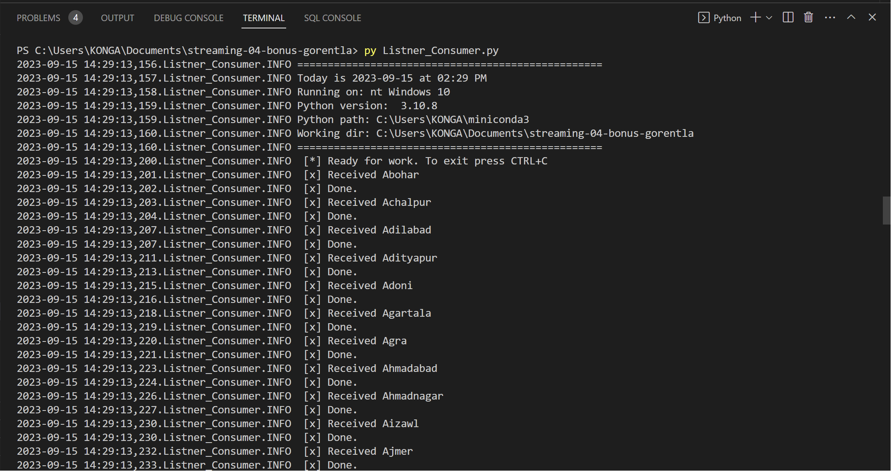
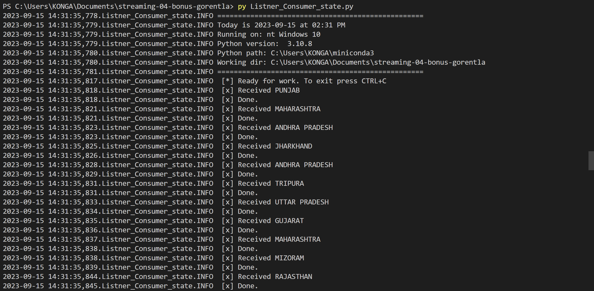

# streaming-04-bonus-gorentla
Priyanka Gorentla </br>
Modified Date: 15th September 2023 </br>
Module 4 bonus </br>

Original data is from Kaggle : https://www.kaggle.com/datasets/zed9941/top-500-indian-cities  </br>
Original data is from Kaggle : https://www.kaggle.com/datasets/yasserh/housing-prices-dataset  </br>


## Prerequisites

1. Git
1. Python 3.7+ (3.11+ preferred)
1. VS Code Editor
1. VS Code Extension: Python (by Microsoft)
1. RabbitMQ Server installed and running locally

## Before You Begin

1. Fork this starter repo into your GitHub account.
1. Clone your repo down to your machine.
1. Explore your new project repo in VS Code on your local machine.

## Task 1. Create a Python Virtual Environment

We will create a local Python virtual environment to isolate our project's third-party dependencies from other projects.

1. Open a terminal window in VS Code.
1. Use the built-in Python utility venv to create a new virtual environment named `.venv` in the current directory.

```shell
python -m venv .venv
```
.
Verify you get a new .venv directory in your project. 
We use .venv as the name to keep it away from our project files. 

## Task 2. Activate the Virtual Environment

In the same VS Code terminal window, activate the virtual environment.

- On Windows, run: `.venv\Scripts\activate`
- On Linux/MacOS, run: `source .venv/bin/activate`

Verify you see the virtual environment name (.venv) in your terminal prompt.

## Task 3. Install Dependencies into the Virtual Environment

To work with RabbitMQ, we need to install the pika library.
A library is a collection of code that we can use in our own code.
Learning to use free libraries that others have written to make our projects easier, faster, more reliable is a key skill for a developer.

## Task 4. Getting one CSV file and doing required Process

1. I have choosen this data set (Top 500 Indian cities) merging the census 2011 of Indian Cities with Population more than 1 Lac and City wise number of Graduates from the Census 2011, to create a visualization of where the future cities of India stands today. </br>
2. Wrote python code emitter_producer.py and Listner_Consumer.py by taking reference of module 2,3,4 assignments for reading csv file.</br>
3. Run consumer and producer python programs by "py Emitter_producer.py" , "py Listner_Consumer_city.py" and "py Listner_Consumer_state.py" in the terminal.</br>




